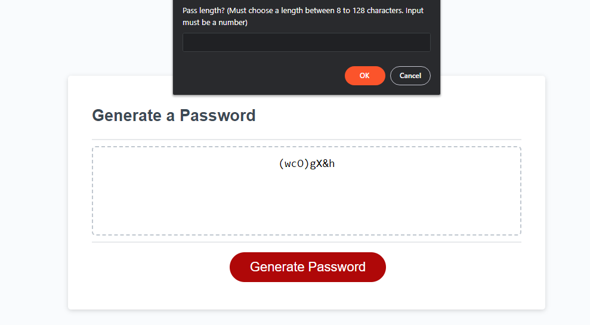

# passGenerator

This is a password generator. This tool will allow you to generate a password between 8 to 128 characters and can include character types such as lower case, upper case, numeric values, and special characters. 

## Installation

N/A 

## Usage

Find deployed application here https://iskry.github.io/passGenerator/ 

## Contributing
Pull requests are welcome. For major changes, please open an issue first to discuss what you would like to change.

## License
[MIT](https://choosealicense.com/licenses/mit/)
